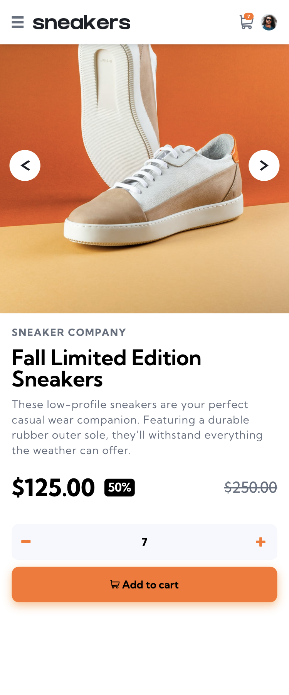

# Frontend Mentor - E-commerce product page solution

This is a solution to the [E-commerce product page challenge on Frontend Mentor](https://www.frontendmentor.io/challenges/ecommerce-product-page-UPsZ9MJp6).

## Table of contents

- [Overview](#overview)
  - [Screenshot](#screenshot)
  - [Links](#links)
- [My process](#my-process)
  - [Built with](#built-with)
  - [What I learned](#what-i-learned)
  - [Continued development](#continued-development)
- [Author](#author)

## Overview

### Screenshot

### Links

- Solution URL: 
- Live Site URL: 

## My process

### Built with

- Semantic HTML5 markup
- CSS custom properties
- Flexbox
- CSS Grid
- Mobile-first workflow
- [React Vite](https://reactjs.org/) - JS library
- [Styled Components](https://styled-components.com/) - For styles: Tailwincss
- [motion]

### What I learned

- I learnt how to use motion (https://motion.dev/) to slide the images.
- Learnt how to use tailwindcss for react vite project.

### Continued development

- I went ahead to creat an order summary page and a tracking order page.

## Author

- Website - [Vera Ama Pomaa](https://www.ecommerce-product-page-vera.netlify.app/)
- Frontend Mentor - [@vera-poms](https://www.frontendmentor.io/profile/vera-poms)

